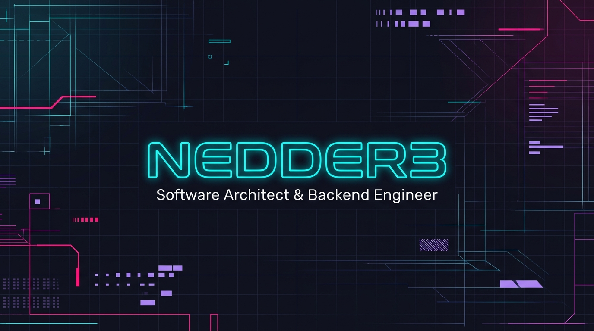

<!-- Banner -->

  

  <h2>Software Architect & Backend Engineer</h2>
  
<i>"Don't show twenty apps. Show a few, designed impeccably."</i>

---

### About

Software engineer focused on **infrastructure-level components** — event buses, cache engines, rule interpreters — built with the same rigor you'd apply to production distributed systems. I design for correctness under concurrency, not just "it works on my machine."

Previously mentored development teams on Clean Architecture, SOLID, and domain-driven design. I believe the best code is the code you don't have to rewrite.

---

### Core Competencies

- **Concurrency & Non-Blocking Algorithms** — CAS-based lock-free structures, `CompletableFuture` orchestration, `ExecutorService` tuning, bounded queues with backpressure
- **Architecture** — Clean Architecture, DDD, CQRS + Event Sourcing, microservice decomposition
- **Distributed Systems** — Event-driven messaging, eventual consistency, Saga pattern, Outbox
- **Backend** — Java 21, Spring Boot, .NET, gRPC, REST/OpenAPI

---

### Tech Stack

| Layer | Tools |
|---|---|
| Languages | Java 21, Python, C#, TypeScript, SQL |
| Frameworks | Spring Boot, Spring Security, .NET Core, gRPC |
| Data | PostgreSQL, Redis, Apache Kafka, SQLite |
| Infrastructure | Docker, AWS (S3, IAM, Lambda, EC2), Git |
| Dev Tools | IntelliJ IDEA, VS Code, Maven, GitHub Actions |

---

### Featured Projects

#### [java-event-bus](https://github.com/nedder3/java-event-bus) — Async High-Concurrency In-Memory Event Bus

The flagship project. A lock-free event bus for modular monoliths that need sub-millisecond event dispatch without external broker overhead.

- **Dispatch modes**: Fan-out to all subscribers or round-robin (only one consumer per event)
- **Backpressure**: Bounded capacity with configurable overflow policy — REJECT (throws `RejectedExecutionException`) or DROP (silently discards, tracks via `Droppable.droppedCount`)
- **Builder API**: Thread-safe with CAS-based internal state — immutable config after construction
- **Non-blocking core**: Lock-free queue internals using `ConcurrentLinkedQueue`, zero `synchronized` blocks on the hot path
- **42 tests**, all green — including concurrency stress tests with multiple producers/subscribers

*Java 21, Concurrency API, ExecutorService, CompletableFuture, CAS*

#### [distributed-cache-engine](https://github.com/nedder3/distributed-cache-engine) — Distributed In-Memory Cache

Key-value cache with async cross-node replication. Eviction strategies (LRU, LFU), active-active replication for reliable internal networks. *In development.*

#### [cqrs-core-lib](https://github.com/nedder3/cqrs-core-lib) — CQRS + Event Sourcing Framework

Decoupled command/query separation with synchronous and asynchronous command buses. Real-time database projections via event triggers. *In development.*

#### [custom-api-gateway](https://github.com/nedder3/custom-api-gateway) — L7 Reverse Proxy & API Gateway

Dynamic Layer 7 router for microservices with built-in load balancing, pre/post-routing filters, Token Bucket rate limiting, and Circuit Breaker fault tolerance. *In development.*

#### [rule-engine-core](https://github.com/nedder3/rule-engine-core) — Dynamic Business Rule Engine

Runtime rule interpreter using DSL/JSON-defined conditional rules. Binary tree evaluation in microseconds against Java POJOs. Decouples volatile business logic from compiled code. *In development.*

#### [auth-service-security](https://github.com/nedder3/auth-service-security) — OAuth2/OIDC Authorization Server

Centralized auth for distributed systems. Async JWT issuance with asymmetric cryptography (RSA/ECDSA), JWKS endpoint for key rotation, MFA integration. *In development.*

---

### GitHub Stats

  
  &nbsp;&nbsp;
  

---

### Contact

